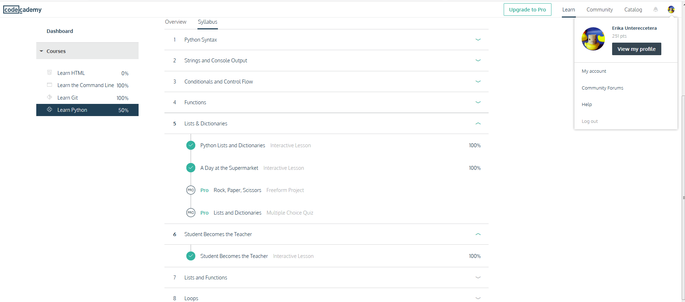

Here are my solutions for the regular expressions-practicum:

```
Solution for Part I, 3:

\b[IEShH][s?ie][bpfs]p?[aa](ha?a?n)|nesf-e jahan\b

Solution for Part II, 1:
Step 1: \t(von )?(\w+), (\w+)$
Step 2: didn't work for me

Solution for Part II, 2:
Connect everything with |: Vienna|Graz|Linz|Salzburg|Innsbruck|Klagenfurt|Villach|Wels|Sankt Pölten|Dornbirn|Wiener Neustadt|Steyr|Feldkirch|Bregenz|Leonding|Klosterneuburg|Baden bei Wien|Wolfsberg|Leoben|Krems|Traun|Amstetten|Lustenau|Kapfenberg|Mödling|Hallein|Kufstein|Traiskirchen|Schwechat|Braunau am Inn|Stockerau|Saalfelden|Ansfelden|Tulln|Hohenems|Spittal an der Drau|Telfs|Ternitz|Perchtoldsdorf|Feldkirchen|Bludenz|Bad Ischl|Eisenstadt|Schwaz|Hall in Tirol|Gmunden|Wörgl|Wals-Siezenheim|Marchtrenk|Bruck an der Mur|Sankt Veit an der Glan|Korneuburg|Neunkirchen|Hard|Vöcklabruck|Lienz|Rankweil|Hollabrunn|Enns|Brunn am Gebirge|Ried im Innkreis|Bad Vöslau|Waidhofen|Knittelfeld|Trofaiach|Mistelbach|Zwettl|Völkermarkt|Götzis|Sankt Johann im Pongau|Gänserndorf|Gerasdorf bei Wien|Ebreichsdorf|Bischofshofen|Groß-Enzersdorf|Seekirchen am Wallersee|Sankt Andrä

Solution for Part II, 3:
\b([\w ]+) \(Lower Austria\)

```


Also, here is the screenshot for the Python Tutorial (next part):

